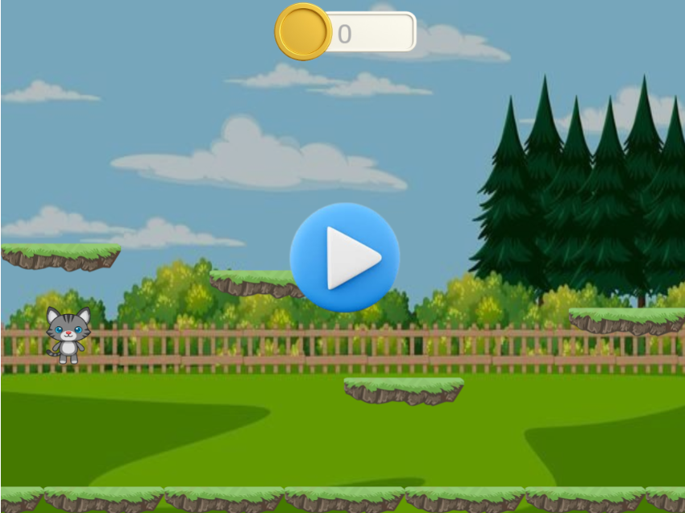
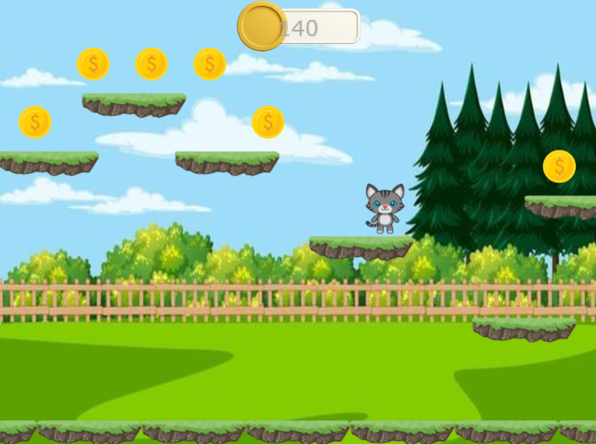

# 🪙 Coin Collector Game

Game 2D sederhana di mana pemain harus mengumpulkan koin sebanyak-banyaknya sambil menghindari rintangan. Cocok dimainkan untuk melatih refleks dan fokus!

---

## 🎮 Tampilan Antarmuka

### 🧭 Menu Utama
Tampilan awal saat game dimulai. Pemain dapat memulai permainan dari sini.



---

### 🚀 Gameplay (Play)
Tampilan saat permainan sedang berlangsung. Pemain mengontrol karakter untuk mengumpulkan koin sebanyak mungkin.



---

## ⚙️ Teknologi yang Digunakan

- Game Engine: [contoh: Unity / Godot / Construct / HTML5 Canvas]
- Bahasa Pemrograman: [JavaScript, HTML]
- Asset Grafis: Custom / Open-source

---

## 📦 Cara Menjalankan Game

1. Clone repository ini:
   ```bash
   git clone https://github.com/username/coin-collector-game.git
